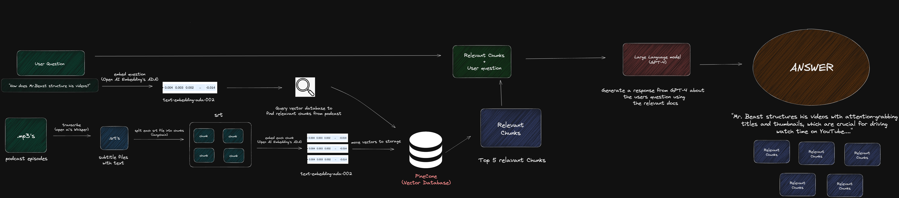

# Creator-Companion
This project leverages OpenAI's Whisper automatic speech recognition (ASR) system, GPT-4, Langchain, and Pinecone's vector database to create a sophisticated search engine to search over 200+ episodes of "The Colin and Samir Show" podcast. The focus is to allow users to input a query and receive the most contextually relevant information from the podcast transcripts.

